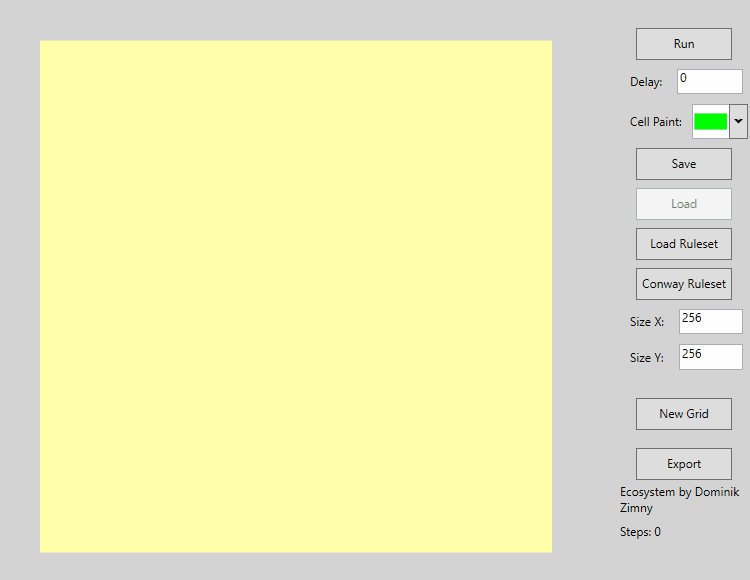

# AllChemist
Design Patterns university project. 


# Idea
This is an expanded Conway's Game of Life that supports custom cell types, rules, world editing etc.

# Custom Rulesets
Implementation uses Strategy Design Pattern for each Cell in the World. Cell Types have a predefined behaviour that executes some kind of logic on a Cell and World. Those predefined behaviours can be used to create very, very different celluar automatas and "game of lifes" both deterministic and non-deterministic. Custom rulesets are generated inside the application (e.g. different variation of Conway's basic rules), but they can be also loaded from a JSON file. 

# Creating Custom Rulesets
In `Data\Rulesets` you will find some examples of JSON formatted Rulesets. They all are classes that implement IRule in `Cell\Rules`. Typically, a Ruleset file has some metadata about creator and name of this ruleset and bank of cell types. The cell with id 0 is a default cell of this Ruleset, meaning the world will fill itself with it at the beginning.

Normally, rules are executed one by one, from the first to the last.

Let's see a example of the defined cells in `default.json`:
```
"0": {
        "Id": 0,
        "Name": "Dead",
        "Color": "#FFFFFFFF",
        "<CellBehaviour>k__BackingField": {
          "Rules": [
            {
              "$type": "AllChemist.Cells.Rules.NeighbourChangeToRule, AllChemist",
              "neighbourId": 1,
              "neighbourCounts": [
                3
              ],
              "neighbourIdToChange": 1
            }
          ]
        }
      },
```

This Dead cell has a behaviour of typical Conway's Dead cell. When there are 3 neighbours of ID equal to 1 then this cell turns into a living cell.

```
      "1": {
        "Id": 1,
        "Name": "Alive",
        "Color": "#FF000000",
        "<CellBehaviour>k__BackingField": {
          "Rules": [
            {
              "$type": "AllChemist.Cells.Rules.SwapToRule, AllChemist",
              "cellToSwapId": 0
            },
            {
              "$type": "AllChemist.Cells.Rules.NeighbourChangeToRule, AllChemist",
              "neighbourId": 1,
              "neighbourCounts": [
                2,
                3
              ],
              "neighbourIdToChange": 1
            }
          ]
        }
      }
```
This is a cell that is Alive and of course it has a behaviour of typical Conway's Alive cell. 
Normally cell dies each step. 
When there are 2 or 3 neighbours of ID equal to 1 then this cell keeps living.

There are no limits to the types of cells you can create. Rules are predefined, but they are easy to modify or adding new ones is fairly simple. See example rulesets to see how different rules are used for given type. Also remember that the full list of all rules are in `Cell\Rules`.

# Used Technologies
C# and WPF

# TODO:
- Importing starting cell combinations from a image file.
- GIF exporting
- No-GUI execution
- More rules

# More examples




Because of gif compression, some colors were lost: green cells have weird black spots.
